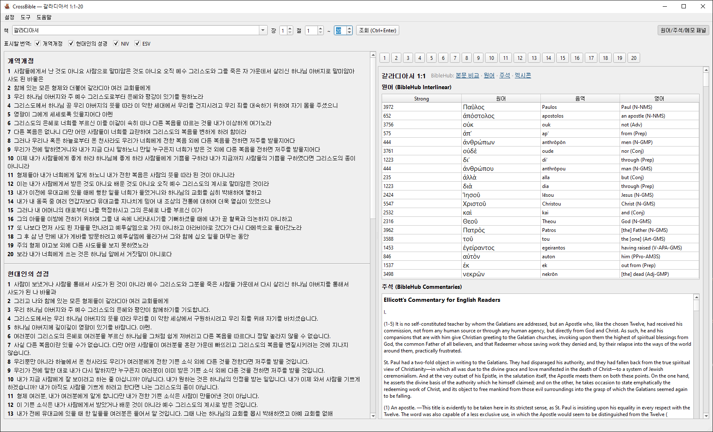
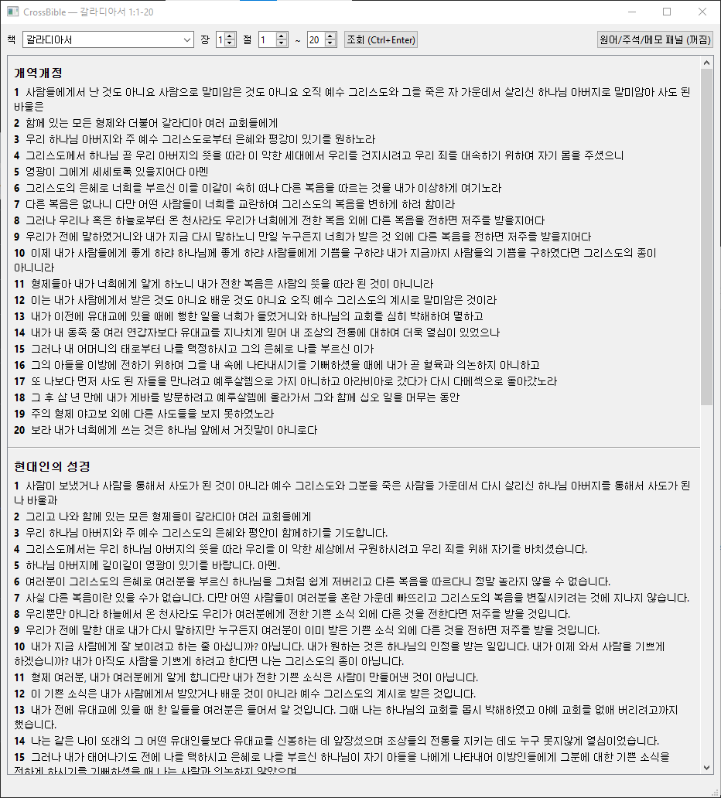

<p align="center">
  
</p>

# CrossBible

여러 한국어/영어 번역본을 한 화면에서 같이 읽으면서, 절마다 원어(BibleHub interlinear)·주석·메모까지 한 곳에 모아 보는 개인 성경 학습용 데스크탑 앱.



사이드 패널을 끄면 (F9) 4개 번역본이 윈도우 전체로 확장됩니다:



## 기능

- **4개 번역 동시 표시**: 개역개정 · 현대인의 성경 · NIV · ESV (체크박스로 켜고 끄기)
- **절별 원어** (Strong's · 헬/히 원어 · 음역 · 영어 의미) — BibleHub Interlinear
- **절별 주석** — BibleHub Commentaries (Ellicott · MacLaren · Benson · Matthew Henry · Barnes · Jamieson-Fausset-Brown · Matthew Poole · Gill · Geneva Study Bible 등 통합)
- **절별 메모 자동 저장** — 로컬 SQLite (`~/.crossbible/data.db`)
- **BibleHub 바로가기**: 절마다 본문 비교 · 원어 · 주석 · 렉시콘 링크 한 줄
- **검색 가능한 책 콤보** — "고"만 입력해도 고린도전서/고린도후서로 좁혀짐
- **사이드 패널 토글** (F9) — 번역본만 보고 싶을 때
- **본문/원어/주석 캐시** — 같은 절을 다시 조회하면 즉시 표시 (네트워크 호출 안 함)
- **오프라인 모드** — *도구 → 전체 다운로드…* 한 번 돌리면 1189장 × 번역본 수가 통째로 로컬 캐시. 비행기 모드에서도 즉시 조회
- **테마** — *설정 → 테마*: System · Fusion Light · Fusion Dark · Solarized Light. QSettings로 영구 저장
- **언어** — *설정 → 언어*: 한국어 / English (UI chrome)
- **한↔영 사전 팝업** — *도구 → 영어사전…*: 한글이면 영어로, 영어면 한글로 자동 번역 (Google Translate 공개 엔드포인트)

## 설치 · 실행

### Windows — Releases에서 받기 (가장 쉬움)

[Releases 페이지](https://github.com/yeonju7kim/CrossBible/releases)에서 최신 zip을 다운로드합니다.

1. 최신 `CrossBible_v*.zip` 다운로드 → 압축 해제
2. `build_windows.bat` 실행 (Python 필요 — 없으면 [Microsoft Store에서 설치](https://apps.microsoft.com/detail/9PNRBTZXMB4Z))
3. 빌드가 끝나면 `CrossBible\dist\CrossBible\CrossBible.exe` 더블클릭

### Windows — 소스에서 직접 실행 (빌드 없이)

이 저장소를 clone 또는 zip으로 받은 뒤 `run_windows.bat` 더블클릭. 처음 한 번만 venv를 만들고 `requirements.txt`를 설치한 다음 바로 실행됩니다.

### 일반 (macOS · Linux · 직접 venv)

Python 3.10+ 필요.

```bash
python -m venv .venv
source .venv/bin/activate     # Windows: .venv\Scripts\activate
pip install -r requirements.txt
python main.py
```

## 사용

1. 상단에서 **책**·**장**·**절 범위**를 고르고 **조회** (또는 **Ctrl+Enter**).
2. 좌측에 4개 번역본이 위→아래로 쌓여 표시됩니다. 두 번째 줄의 체크박스로 보고 싶은 번역만 켜고 끌 수 있어요.
3. 우측에 절별 묶음(원어 표 · 주석 · 메모)이 위→아래로 쌓여 표시됩니다.
   - 절 헤더의 **BibleHub** 링크로 원본 페이지를 새 창에서 열 수 있습니다.
   - 절수가 많으면 본문 → 절별 원어/주석 순으로 들어옵니다. 상태바에 진행 표시(`원어/주석 N/M`).
4. 메모 칸에 친 글은 자동으로 저장됩니다. 같은 절을 다음에 다시 조회하면 그대로 불러옵니다.
5. 오른쪽 패널이 거슬리면 **F9** 또는 우측 상단 토글 버튼으로 끄세요.

### 메뉴

- **설정 → 테마**: 4가지 중 선택. 즉시 적용 + 다음 실행에도 유지.
- **설정 → 언어**: 한국어 / English. 변경 후 앱 재시작하면 메뉴/버튼/상태바 모두 그 언어로.
- **도구 → 전체 다운로드…**: 현재 체크된 번역본의 모든 책·장을 캐시. 진행률 다이얼로그(취소 가능). 이미 받은 장은 건너뛰니 중간에 끊겨도 다시 눌러 재개하면 됩니다.
- **도구 → 영어사전…**: 단어 또는 짧은 구절을 입력하면 한↔영 자동 번역. 모드리스 팝업이라 본문 보면서 띄워둘 수 있어요.

## 데이터 출처 · 저작권

본 코드는 어떠한 성경 본문도 임베드하지 않습니다. 본문은 사용자 본인 머신에서 다음 사이트에 요청해 가져와 로컬 SQLite 캐시에만 저장합니다. 본문 자체의 저작권은 각 권리자에게 있으며, 본 앱은 **개인 학습 용도**로만 사용해 주세요.

| 항목 | 소스 | 저작권 |
|---|---|---|
| 개역개정 | 대한성서공회 (bskorea.or.kr) | 대한성서공회 |
| 현대인의 성경 (KLB) | Bible Gateway | Biblica/생명의 말씀사 |
| NIV / ESV | Bible Gateway | Biblica · Crossway |
| Interlinear · Commentary · Lexicon | BibleHub | BibleHub / 각 commentator |
| 사전 (한↔영) | Google Translate (gtx endpoint) | Google |

요청 사이에 ~0.7초 throttle을 둡니다. **전체 다운로드**도 같은 throttle을 따르며 번역본 하나당 약 14분 정도 걸립니다.

## 한계

- **우리말성경 · 쉬운성경**: 무료 공개 API/페이지가 확인되지 않아 미연동. 사용 가능한 소스를 알면 `fetchers.py`에 추가하면 됩니다.
- 한 번에 20절까지 조회 가능. 그 이상은 안내 메시지로 막혀 있어요.
- 일부 번역(예: KLB 창 1:6-7)은 인접 절을 합본으로 번역합니다. 이 경우 두 절 위치에 같은 본문이 표시됩니다.

## 트러블슈팅

**`CrossBible.exe`를 다시 빌드했는데 아이콘이 이전 그대로 보여요.**
Windows Explorer/작업표시줄의 아이콘 캐시 때문입니다. `build_windows.bat`은 `ie4uinit.exe -show`로 갱신을 시도하지만, 그래도 안 되면:
1. `dist\CrossBible` 폴더를 다른 위치로 옮겼다가 다시 가져오기
2. 로그오프 후 다시 로그인 (또는 재부팅)
3. `%LOCALAPPDATA%\IconCache.db` 삭제 후 explorer 재시작

## 파일

```
main.py            진입점
ui.py              PyQt6 메인 윈도우 / 메뉴 / 다이얼로그 (i18n · 테마 포함)
fetchers.py        bskorea / Bible Gateway / BibleHub 스크래퍼 + 캐시 통합 + 전체 다운로드
storage.py         SQLite 캐시 + 노트 저장 (thread-safe)
translator.py      Google Translate 공개 엔드포인트 wrapper (한↔영 사전)
reference.py       Reference dataclass
bible_books.py     66권 한·영 이름/약어, 장수
assets/            아이콘 · 스크린샷
requirements.txt   PyQt6 · requests · beautifulsoup4
run_windows.bat    빌드 없이 venv 자동 셋업 + 실행
build_windows.bat  PyInstaller로 단일 exe 빌드 (PNG→ICO 자동 변환, Pillow 사용)
```

설정·언어 선택은 OS 표준 위치의 QSettings에 저장됩니다 (Windows 레지스트리, macOS plist, Linux `~/.config`).
