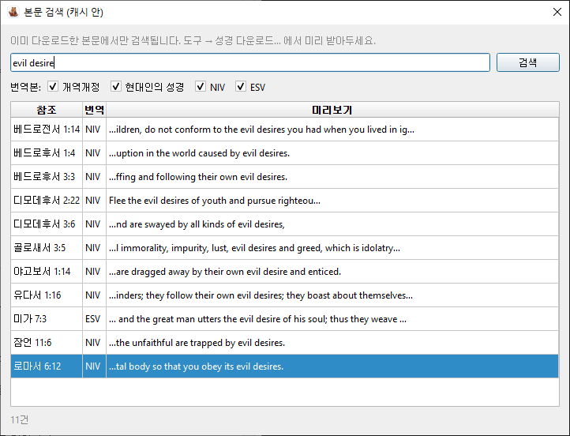
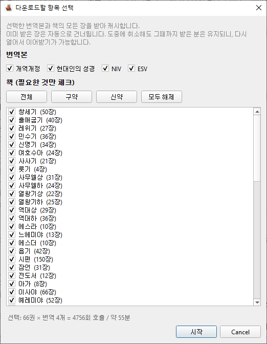
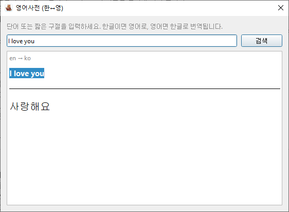

<p align="center">
  
</p>

# CrossBible

여러 한국어/영어 번역본을 한 화면에서 같이 읽으면서, 절마다 원어(BibleHub interlinear)·주석·메모까지 한 곳에 모아 보는 개인 성경 학습용 데스크탑 앱.


사이드 패널을 끄면 (F9) 4개 번역본이 윈도우 전체로 확장됩니다:


기타 다이얼로그:

<table>
<tr>
<td align="center"><b>본문 검색 (Ctrl+F)</b><br/></td>
<td align="center"><b>성경 다운로드</b><br/></td>
<td align="center"><b>영어사전 (한↔영)</b><br/></td>
</tr>
</table>

## 기능

- **5개 번역 동시 표시**: 개역개정 · 우리말성경 · 현대인의 성경 · NIV · ESV (체크박스로 켜고 끄기)
- **절별 원어** (Strong's · 헬/히 원어 · 음역 · 영어 의미) — BibleHub Interlinear
- **절별 주석** — BibleHub Commentaries (Ellicott · MacLaren · Benson · Matthew Henry · Barnes · Jamieson-Fausset-Brown · Matthew Poole · Gill · Geneva Study Bible 등 통합)
- **절별 메모 자동 저장** — 로컬 SQLite (`~/.crossbible/data.db`)
- **BibleHub 바로가기**: 절마다 본문 비교 · 원어 · 주석 · 렉시콘 링크 한 줄
- **검색 가능한 책 콤보** — "고"만 입력해도 고린도전서/고린도후서로 좁혀짐
- **사이드 패널 토글** (F9) — 번역본만 보고 싶을 때
- **본문/원어/주석 캐시** — 같은 절을 다시 조회하면 즉시 표시 (네트워크 호출 안 함)
- **키워드 검색** (Ctrl+F) — 캐시된 본문에서 한/영 부분 일치 검색. 결과 더블클릭하면 그 절로 자동 점프
- **절 점프 네비게이션** — 우측 패널 위에 절 번호 버튼이 한 줄로 떠 있어, 한 번에 20절까지 펼쳐도 클릭 한 번이면 해당 절로 점프
- **부분/전체 다운로드 (오프라인)** — *도구 → 성경 다운로드…* : 번역본·책을 골라 캐시. 구약/신약 빠른 선택 버튼, 이미 받은 장은 자동 skip 이라 취소 후 이어받기 자유. 비행기 모드에서도 받은 절은 즉시 조회
- **테마** — *설정 → 테마*: System · Fusion Light · Fusion Dark · Solarized Light. 다음 실행 때 마지막 테마가 그대로 유지됨
- **언어** — *설정 → 언어*: 한국어 / English (UI chrome)
- **한↔영 사전 팝업** — *도구 → 영어사전…*: 한글이면 영어로, 영어면 한글로 자동 번역 (Google Translate 공개 엔드포인트). 본문 보면서 열어둘 수 있는 모드리스 창
- **캐시 정보 팝업** — *도구 → 캐시 정보…*: 어디에 뭐가 저장되는지, 번역본별 절 수, 파일 크기 표시 + "폴더 열기"
- **건의/이슈** — *도움말 → 건의사항…* 으로 GitHub Issues 페이지 바로 열기

## 설치 · 실행

### Windows — Releases에서 받기 (가장 쉬움)

[Releases 페이지](https://github.com/yeonju7kim/CrossBible/releases)에서 최신 zip을 다운로드합니다.

1. 최신 `CrossBible_v*.zip` 다운로드 → 압축 해제
2. `build_windows.bat` 실행 (Python 필요 — 없으면 [Microsoft Store에서 설치](https://apps.microsoft.com/detail/9PNRBTZXMB4Z))
3. 빌드가 끝나면 `CrossBible\dist\CrossBible\CrossBible.exe` 더블클릭

### Windows — 소스에서 직접 실행 (빌드 없이)

이 저장소를 clone 또는 zip으로 받은 뒤 `run_windows.bat` 더블클릭. 처음 한 번만 venv를 만들고 `requirements.txt`를 설치한 다음 바로 실행됩니다.

### 일반 (macOS · Linux · 직접 venv)

Python 3.10+ 필요.

```bash
python -m venv .venv
source .venv/bin/activate     # Windows: .venv\Scripts\activate
pip install -r requirements.txt
python main.py
```

## 사용

1. 상단에서 **책**·**장**·**절 범위**를 고르고 **조회** (또는 **Ctrl+Enter**).
2. 좌측에 4개 번역본이 위→아래로 쌓여 표시됩니다. 두 번째 줄의 체크박스로 보고 싶은 번역만 켜고 끌 수 있어요.
3. 우측에 절별 묶음(원어 표 · 주석 · 메모)이 위→아래로 쌓여 표시됩니다.
   - 절 헤더의 **BibleHub** 링크로 원본 페이지를 새 창에서 열 수 있습니다.
   - 절수가 많으면 본문 → 절별 원어/주석 순으로 들어옵니다. 상태바에 진행 표시(`원어/주석 N/M`).
4. 메모 칸에 친 글은 자동으로 저장됩니다. 같은 절을 다음에 다시 조회하면 그대로 불러옵니다.
5. 오른쪽 패널이 거슬리면 **F9** 또는 우측 상단 토글 버튼으로 끄세요.

### 메뉴

- **설정 → 테마**: 4가지 중 선택. 즉시 적용 + 다음 실행에도 그대로 유지.
- **설정 → 언어**: 한국어 / English. 변경 후 앱 재시작하면 메뉴/버튼/상태바 모두 그 언어로.
- **도구 → 성경 다운로드…**: 번역본 4개 + 책 66권을 자유롭게 체크해서 부분 다운로드. *전체 / 구약 / 신약 / 모두 해제* 빠른 선택 버튼과 실시간 요약 (예: `27권 × 번역 1개 = 260회 호출 / 약 3분`). 이미 받은 장은 자동 skip 이라 도중 취소 → 다시 열기 → 이어받기 가능. 취소 버튼은 0.1초 안에 반응.
- **도구 → 검색…** (Ctrl+F): 캐시된 본문에서 한/영 부분 일치 검색. 번역본 필터 + 결과 미리보기. 더블클릭 시 그 절로 자동 조회. *다운로드한 본문만 검색되니 도구 → 성경 다운로드… 를 먼저 돌려두세요.*
- **도구 → 영어사전…**: 단어 또는 짧은 구절을 입력하면 한↔영 자동 번역. 모드리스 팝업이라 본문 보면서 띄워둘 수 있어요.
- **도구 → 캐시 정보…**: 저장 위치 (`~/.crossbible/data.db`) · 파일 크기 · 번역본별 행 수 표시. *폴더 열기* 버튼으로 OS 파일 탐색기 바로 띄움.
- **도구 → 캐시 백업 (.db 내보내기)…**: 현재 캐시 파일을 원하는 위치/이름으로 저장. 본인 다른 PC 로 이전, USB 백업 등에 사용.
- **도구 → 캐시 불러오기 (.db 병합)…**: 다른 CrossBible `.db` 파일에서 본문·원어·주석을 현재 캐시에 **병합**. 같은 키는 자동 skip 이라 같은 파일을 여러 번 합쳐도 안전. **메모는 본인 PC 의 것을 유지**하고 가져오지 않음.
- **도움말 → 건의사항…**: GitHub Issues 페이지를 기본 브라우저로 엽니다.
- **도움말 → 버전 정보…**: 현재 버전과 GitHub 링크.

## 데이터 출처 · 저작권

본 코드는 **어떠한 성경 본문도 임베드하지 않습니다.** 본문은 사용자 본인 머신에서 아래 사이트에 요청해 가져와 로컬 SQLite 캐시 (`~/.crossbible/data.db`) 에만 저장됩니다. 본문 자체의 저작권은 각 권리자에게 있으며, 본 앱은 **개인 학습 · 연구 용도**로만 사용해 주세요.

| 항목 | 소스 | 저작권 |
|---|---|---|
| 개역개정 | 대한성서공회 (bskorea.or.kr) | 대한성서공회 |
| 우리말성경 (WLB) | nocr.net/korwrm | 두란노 (사이트 자체 라이선스 명시는 부재) |
| 현대인의 성경 (KLB) | Bible Gateway | Biblica / 생명의 말씀사 |
| NIV | Bible Gateway | Biblica |
| ESV | Bible Gateway | Crossway |
| Interlinear · Commentary · Lexicon | BibleHub | BibleHub / 각 commentator |
| 사전 (한↔영) | Google Translate (gtx endpoint) | Google |

> **우리말성경 주의**: nocr.net 페이지에 권리자 동의 표시가 없습니다. 두란노가 본문 저작권자이며, 사이트가 권리자 신고로 갑자기 사라질 수도 있어요. 다른 source(bskorea/BibleGateway/BibleHub) 와 동일한 회색지대 위에서 동작하지만, 명시적 라이선스 표기가 더 약하다는 점만 알아두세요.

요청 사이에 ~0.7초 throttle을 둡니다. **성경 다운로드**도 같은 throttle을 따르며 번역본 한 개 × 66권 기준 약 14분, 신약(27권)만 받으면 약 3분 정도입니다.

### 캐시 파일을 어디에 두면 되고, 어디에 두면 안 되는지

**`~/.crossbible/data.db` 안에는 위 권리자들의 본문이 들어 있습니다.** 즉 코드와 달리 DB 파일은 저작권 보호 콘텐츠를 담은 사본이에요. 다음 가이드를 지켜주세요.

- ✅ **OK**: 본인이 쓰는 다른 PC로 이전 (USB · 외장 디스크), 본인 클라우드 드라이브(Dropbox/OneDrive/iCloud) 안에 두기. 본인 백업 / 본인 동기화는 사적 사용 범위.
- ⚠️ **권장하지 않음**: 친구·동료에게 DB 파일을 그대로 전달. 사적 공유라도 라이선스에 따라 회색지대이고, NIV / ESV 는 사용 약관이 특히 엄격합니다. 친구도 본인 PC에서 직접 다운로드 받게 안내하는 게 깔끔.
- ❌ **하지 마세요**: **GitHub 같은 공개 / 비공개 저장소에 DB 파일 업로드.** 본문이 그대로 들어 있는 사본을 재배포하는 행위로 간주되며, NIV / ESV 권리자의 DMCA 신고로 저장소 전체가 takedown 될 수 있습니다. 동일한 이유로 본 저장소도 캐시 파일을 함께 배포하지 않습니다.

이 정책 때문에 "성경 SQL을 git 에 같이 올려서 공유" 같은 흐름은 **의도적으로 지원하지 않아요**. 대신 *도구 → 캐시 백업 (.db 내보내기)…* 으로 본인 PC 들 사이에서 이전하는 워크플로우를 권합니다.

## 한계

- **우리말성경 · 쉬운성경**: 무료 공개 API/페이지가 확인되지 않아 미연동. 사용 가능한 소스를 알면 `fetchers.py`에 추가하면 됩니다.
- 한 번에 20절까지 조회 가능. 그 이상은 안내 메시지로 막혀 있어요.
- 일부 번역(예: KLB 창 1:6-7)은 인접 절을 합본으로 번역합니다. 이 경우 두 절 위치에 같은 본문이 표시됩니다.
- 다운로드 시 챕터 단위 파싱은 절 누락 **검사를 하지 않습니다** (개별 조회는 검사함). 사이트가 어쩌다 한두 절을 빠뜨려도 그 챕터는 "성공"으로 캐시됩니다. 정확한 검증이 필요하면 `~/.crossbible/data.db` 에서 번역본별 절 수를 확인하세요 (각 번역본 약 31,102절).
- 원어/주석은 다운로드 대상이 아닙니다. 조회한 절만 캐시되니, 자주 보는 책은 한 번씩 펼쳐두면 그때 캐시가 채워집니다.

## 기여 환영해요 (Contributing)

개인 학습 목적으로 만든 작은 도구지만, 도와주실 분이 있다면 정말 감사해요. **Pull Request 환영합니다.**

작업 흐름:

1. [Issues](https://github.com/yeonju7kim/CrossBible/issues) 에서 작업할 주제를 고르거나, 새 아이디어가 있으면 먼저 이슈로 올려주세요.
2. 저장소를 fork → 작업 브랜치에서 코드 수정 → `python main.py` 로 실제 동작 확인.
3. 본 저장소의 `main` 브랜치를 대상으로 Pull Request 를 보내주세요.

이런 종류의 PR이 특히 도움 됩니다:

- **디자인 / UI 감각** ← 솔직히 가장 필요합니다 🙏 — 색상·여백·타이포그래피·아이콘 같은 비주얼 다듬기, 더 보기 좋은 테마 추가, 레이아웃 비율 등. 지금은 기능 위주로 만들어서 미적 감각이 아쉬워요. CSS-스타일 QSS 패치, 새 테마 프리셋, 더 예쁜 아이콘 어떤 형태든 환영
- **새 번역본 fetcher** — 우리말성경, 쉬운성경, 새번역 같은 한국어 번역의 무료 공개 소스를 알면 `fetchers.py` 에 추가
- **다른 언어 UI** — `ui.py` 의 `STRINGS` 사전에 키 추가로 새 언어 지원
- **버그 수정 / 사용성 개선** — 특히 다양한 환경(고해상도, 폰트, 다른 OS)에서 레이아웃 깨짐
- **테스트** — 현재는 smoke test 위주, 단위 테스트 환영

작은 변경(한 줄 오타, 라벨 수정 등) 도 이슈 없이 바로 PR 보내주셔도 OK.

## 트러블슈팅

**`CrossBible.exe`를 다시 빌드했는데 아이콘이 이전 그대로 보여요.**
Windows Explorer/작업표시줄의 아이콘 캐시 때문입니다. `build_windows.bat`은 `ie4uinit.exe -show`로 갱신을 시도하지만, 그래도 안 되면:
1. `dist\CrossBible` 폴더를 다른 위치로 옮겼다가 다시 가져오기
2. 로그오프 후 다시 로그인 (또는 재부팅)
3. `%LOCALAPPDATA%\IconCache.db` 삭제 후 explorer 재시작

## 파일

```
main.py            진입점
ui.py              PyQt6 메인 윈도우 / 메뉴 / 다이얼로그 (i18n · 테마 포함)
fetchers.py        bskorea / Bible Gateway / BibleHub 스크래퍼 + 캐시 통합 + 전체 다운로드
storage.py         SQLite 캐시 + 노트 저장 (thread-safe)
translator.py      Google Translate 공개 엔드포인트 wrapper (한↔영 사전)
reference.py       Reference dataclass
ref_parser.py      자유 텍스트 성구 참조 파서 ("Acts 12:12, 12:25, Col 4:10")
bible_books.py     66권 한·영 이름/약어, 장수
assets/            아이콘 · 스크린샷
requirements.txt   PyQt6 · requests · beautifulsoup4
run_windows.bat    빌드 없이 venv 자동 셋업 + 실행
build_windows.bat  PyInstaller로 단일 exe 빌드 (PNG→ICO 자동 변환, Pillow 사용)
```

설정·언어 선택은 OS 표준 위치의 QSettings에 저장됩니다 (Windows 레지스트리, macOS plist, Linux `~/.config`).
